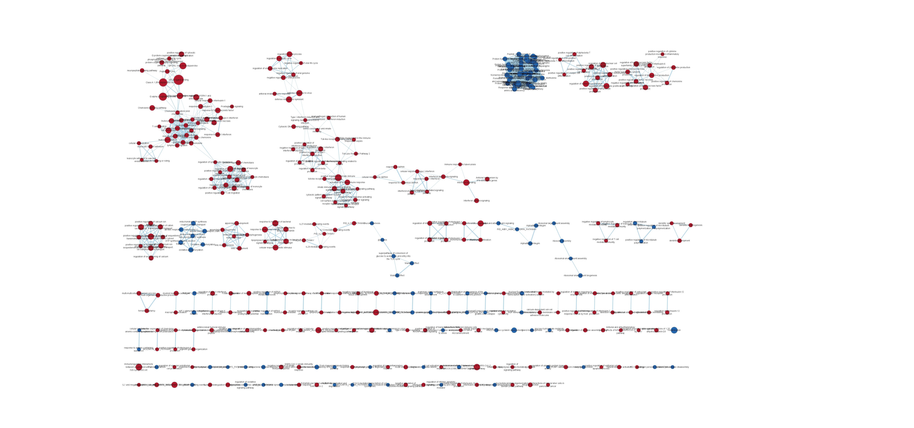
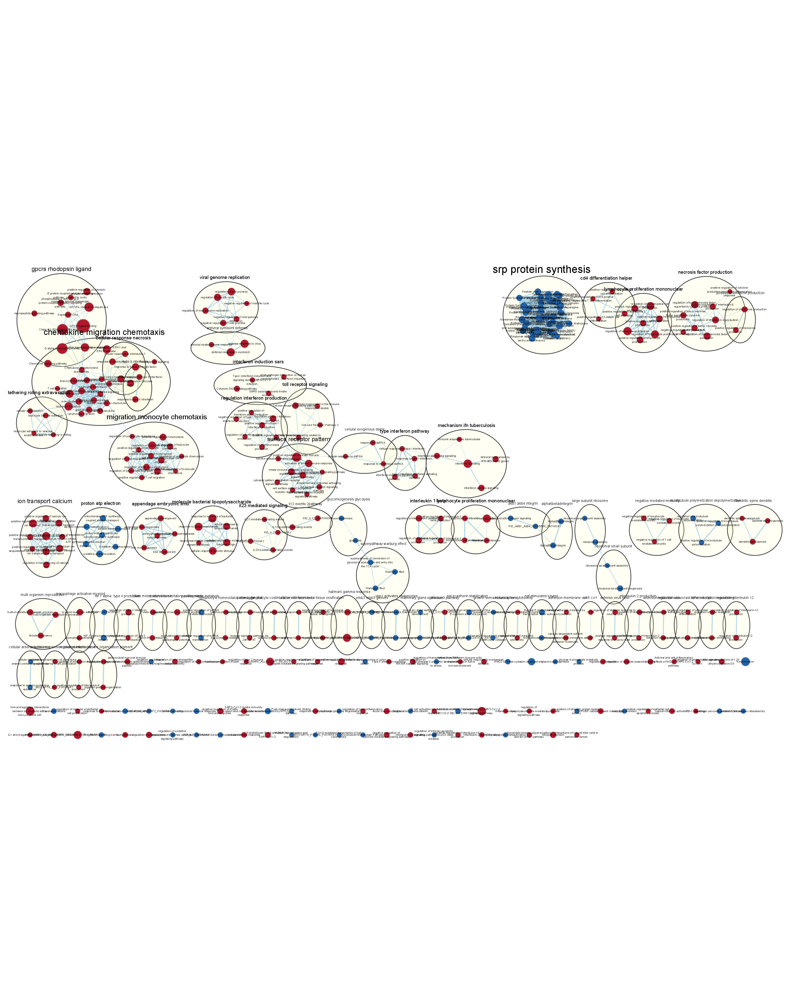
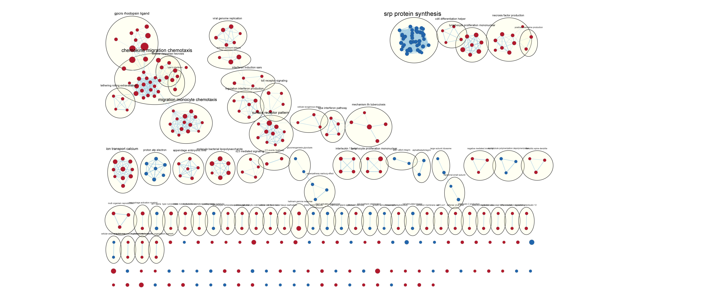
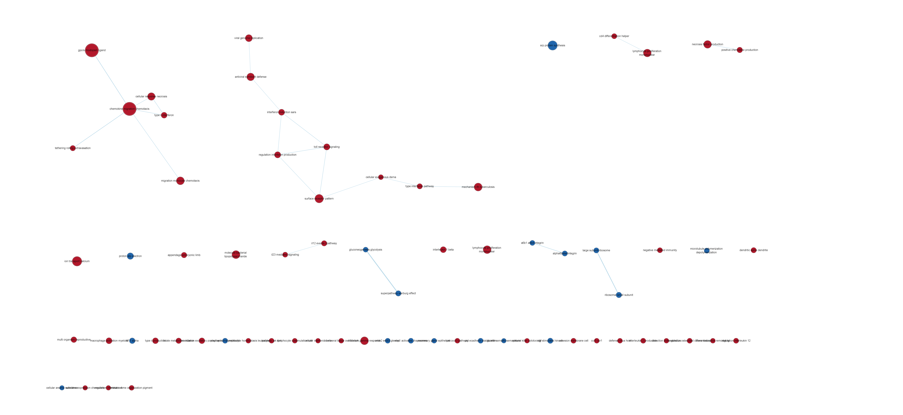

[@geometadb]
[@knitr]
[@edger]
[@biocmanager]
[@biomart]
[@circlize]
[@complex]
[@ggplot2]
[@ggrepel]
[@gprofile]
```{r, message= FALSE}
if (!requireNamespace("GEOmetadb", quietly = TRUE))
  BiocManager::install("GEOmetadb")

if (!requireNamespace("knitr", quietly = TRUE))
  install.packages("knitr")

if (!require("edgeR", quietly = TRUE))
  BiocManager::install("edgeR")

if (!requireNamespace("BiocManager", quietly = TRUE))
  install.packages("BiocManager")

if (!requireNamespace("biomaRt", quietly = TRUE))
  BiocManager::install("biomaRt")

if (!requireNamespace("ComplexHeatmap", quietly = TRUE))
  BiocManager::install("ComplexHeatmap")

if (!requireNamespace("circlize", quietly = TRUE))
  BiocManager::install("circlize")

if (!requireNamespace("ggplot2", quietly = TRUE))
  install.packages("ggplot2")

if (!requireNamespace("ggrepel", quietly = TRUE))
  install.packages("ggrepel")

```

## Calling required packages

```{r, message=FALSE}
library(BiocManager)
library(GEOmetadb)
library(knitr)
library(edgeR)
library(biomaRt)
library(ComplexHeatmap)
library(circlize)
library(ggplot2)
library(ggrepel)
```

## Download the data
### GSE152074 raw data supplementary file downloaded

```{r, message=FALSE}
sfiles = getGEOSuppFiles('GSE152075')
fnames = rownames(sfiles)
# there is only one supplemental file
readData = read.table(fnames[1],header=TRUE, check.names = TRUE)
```
## Data

 Data from [@lieberman2020vivo].
```{r}
kable(readData[1:5, 1:5], type = "html", row.names = TRUE)
```

 Table 1: Original data contains HGNC annotation as row names. Column names have prefixes before their identifier number as either POS or NEG. Corresponding to either positive for COVID19 or negative.


## Assess

Add 1 to all values of data so later on when conducting log2(cpm) we can avoid negative infinity values. (Advised by Professor Isserlin)
```{r, message=FALSE}
readData <- readData + 1
```


Setting first column as gene id for future format purposes
```{r}
#Place rownames in first column for future format purposes
inter <- data.frame("HUGO" = rownames(readData))
geneData <- cbind(inter$HUGO, readData)
colnames(geneData)[1] <- "HUGO"
```

## Clean
Remove any outliers that does not have at least 2 read per million in n of the samples.
We set this as 2 since we add 1 to all of our dataset in the beginning of the code to have better plots.
Denoting n as the smallest group of replicates which is the control group of 53.
Using n = 53 conduct the removal of low counts.
```{r}
#translate out counts into counts per millison using 
#the edgeR package function cpm
cpms = cpm(geneData[,2:485])
rownames(cpms) <- geneData[,1]
# get rid of low counts
keep = rowSums(cpms >2) >=53
geneData_exp_filtered = geneData[keep,]
```

Remove version numbers if they exists on gene id(HUGO) column.
This makes it easier for mapping later on.
```{r}
geneData_exp_filtered[,1] <- gsub("\\.[0-9]", "", geneData_exp_filtered[,1])
```

## Map
```{r, message=FALSE}
#Mapping the name using biomatr
# list available gene annotation databases
bio <- useMart("ensembl", dataset = "hsapiens_gene_ensembl")
conversion_stash <- "geneMapping.rds"
if(file.exists(conversion_stash)){
  geneMapping <- readRDS(conversion_stash)
} else{
# convert column of gene IDs to Hugo symbols
geneMapping <- getBM(attributes = c("ensembl_gene_id", "hgnc_symbol"),
                     mart = bio,
                     filters = "hgnc_symbol",
                     values = geneData_exp_filtered[,1])
saveRDS(geneMapping, conversion_stash)
}
```

Combine the mapped gene data to original data
```{r}
#Merge the data
mergedData <- merge(geneData_exp_filtered, geneMapping, by.x = 1, by.y = 2)
#remove duplicate rows in the gene data
mergedDataNoDup <- mergedData[!duplicated(mergedData[,1:485]),]

```

## Apply Normalization
Randomly sample data to reduce the size of sample. Original sample is too large
leading to computation errors due to the limitation of author's computer.
```{r}

set.seed(12345)
randomSamplePOS <- sample(mergedDataNoDup[2:431], 25)
randomSampleNEG <- sample(mergedDataNoDup[432:485], 25)
randomSample <- cbind(randomSamplePOS,randomSampleNEG, mergedDataNoDup$ensembl_gene_id, mergedDataNoDup$HUGO)


```

Define groups to use in normalization
```{r}

samples <- data.frame(lapply(colnames(randomSample[1:50]), 
        FUN=function(x){unlist(strsplit(x, 
                        split = "_"))[c(2,1)]}))
colnames(samples) <- colnames(randomSample[1:50])
rownames(samples) <- c("patients","cell_type")
samples <- data.frame(t(samples))

```


Applying TMM to data
```{r}

filtered_data_matrix <- as.matrix(randomSample[1:50])
rownames(filtered_data_matrix) <- randomSample$`mergedDataNoDup$ensembl_gene_id`
d = DGEList(counts=filtered_data_matrix, group=samples$cell_type)

d = calcNormFactors(d)

normalized_counts <- cpm(d)
#add columns of ensembl and hgnc id

normalized_count_data = data.frame(normalized_counts)
normalized_count_data$ensembl_gene_id <- mergedDataNoDup$ensembl_gene_id
normalized_count_data$hgnc_symbol <- mergedDataNoDup$HUGO


#This is a duplicate ensembl id that is giving errors when running code.
normalized_count_data <- normalized_count_data[-c(1902),]
```


```{r}
model_design <- model.matrix(~samples$cell_type+0)
d <- estimateDisp(d, model_design)
```

# Differential Gene Expression

## LIMMA
p-value calculation using LIMMA
```{r}
model_design <- model.matrix(~ samples$cell_type )
```

```{r}

expressionMatrix <- as.matrix(normalized_count_data[,1:50])
rownames(expressionMatrix) <- 
  normalized_count_data$ensembl_gene_id
colnames(expressionMatrix) <- 
  colnames(normalized_count_data)[1:50]
minimalSet <- ExpressionSet(assayData=expressionMatrix)

```


Taking into account Patient variability
```{r}
model_design_pat <- model.matrix(
  ~ samples$patients + samples$cell_type)
```

```{r}
fit_pat <- lmFit(minimalSet, model_design_pat)
```


```{r}
fit2_pat <- eBayes(fit_pat,trend=TRUE)

topfit_pat <- topTable(fit2_pat, 
                   coef=ncol(model_design_pat),
                   adjust.method = "BH",
                   number = nrow(expressionMatrix))
#merge hgnc names to topfit table
output_hits_pat <- merge(normalized_count_data[,51:52],
                         topfit_pat,by.y=0,by.x=1,all.y=TRUE)
#sort by pvalue
output_hits_pat <- output_hits_pat[order(output_hits_pat$P.Value),]
```

```{r}
length(which(output_hits_pat$P.Value < 0.05))
length(which(output_hits_pat$adj.P.Val < 0.05))
```

## QLF

```{r}
d = DGEList(counts=filtered_data_matrix, group=samples$cell_type)
```
```{r}
d <- estimateDisp(d, model_design_pat)
```

```{r}
fit <- glmQLFit(d, model_design_pat)
```


```{r}
qlf.pos_vs_neg <- glmQLFTest(fit, coef='samples$cell_typePOS')
kable(topTags(qlf.pos_vs_neg), type="html",row.names = FALSE)
```

P-values were corrected using Quasilikelihood method.
Quasilikelihood is better becacuse it is tailored towards RNAseq data

```{r}
qlf_output_hits <- topTags(qlf.pos_vs_neg,sort.by = "PValue",
                           n = nrow(normalized_count_data))
length(which(qlf_output_hits$table$PValue < 0.05))
length(which(qlf_output_hits$table$FDR < 0.05))
```

# Thresholded over-representation analysis

## Write to file upregulated, and downregulated genes

Which ones are upregulated and downregulated
```{r}
length(which(qlf_output_hits$table$PValue < 0.05 
             & qlf_output_hits$table$logFC > 0))

length(which(qlf_output_hits$table$PValue < 0.05 
             & qlf_output_hits$table$logFC < 0))
```

```{r}
qlf_output_hits_withgn <- merge(randomSample[,51:52],qlf_output_hits, by.x=1, by.y = 0)
#number higher the lower the pvalue, and if it is upregulated number is positive, and negative for downregulated
qlf_output_hits_withgn[,"rank"] <- -log(qlf_output_hits_withgn$PValue,base =10) * sign(qlf_output_hits_withgn$logFC)
qlf_output_hits_withgn <- qlf_output_hits_withgn[order(qlf_output_hits_withgn$rank),]
upregulated_genes <- qlf_output_hits_withgn$`mergedDataNoDup$HUGO`[
  which(qlf_output_hits_withgn$PValue < 0.05 
             & qlf_output_hits_withgn$logFC > 0)]
downregulated_genes <- qlf_output_hits_withgn$`mergedDataNoDup$HUGO`[
  which(qlf_output_hits_withgn$PValue < 0.05 
             & qlf_output_hits_withgn$logFC < 0)]
write.table(x=upregulated_genes,
            file=file.path("data","upregulated_genes.txt"),sep = "\t",
            row.names = FALSE,col.names = FALSE,quote = FALSE)
write.table(x=downregulated_genes,
            file=file.path("data","downregulated_genes.txt"),sep = "\t",
            row.names = FALSE,col.names = FALSE,quote = FALSE)
write.table(x=data.frame(genename= qlf_output_hits_withgn$`mergedDataNoDup$HUGO`,F_stat= qlf_output_hits_withgn$rank),
            file=file.path("data","ranked_genelist.txt"),sep = "\t",
            row.names = FALSE,col.names = FALSE,quote = FALSE)
```

# Non-thresholded Gene set Enrichment Analysis

```{r}
gmt_url = "http://download.baderlab.org/EM_Genesets/current_release/Human/symbol/"
# list all the files on the server
filenames = RCurl::getURL(gmt_url)
tc = textConnection(filenames)
contents = readLines(tc)
close(tc)
# get the gmt that has all the pathways and does not include terms inferred
# from electronic annotations(IEA) start with gmt file that has pathways only
rx = gregexpr("(?<=<a href=\")(.*.GOBP_AllPathways_no_GO_iea.*.)(.gmt)(?=\">)", contents,
    perl = TRUE)
gmt_file = unlist(regmatches(contents, rx))
download.file(paste(gmt_url, gmt_file, sep = ""), "bader_lab.gmt")
```

## Conduct non-thresholded gene set enrichment analysis using the ranked set of genes from Assignment #2. \ 

### 1. What method did you use? What genesets did you use? Make sure to specify versions and cite your methods. \ 
I used the GSEA desktop application to run GSEA [@gsea1].  
I used the genesets from the bader lab extracted from the code above I used. Or it can be retrieved from here http://download.baderlab.org/EM_Genesets/current_release/Human/symbol/.  

### 2. Summarize your enrichment results.\ 
SARs-CoV-2 positive samples:  
4965 / 6074 gene sets are upregulated in phenotype na_pos  
442 gene sets are significant at FDR < 25%  
410 gene sets are significantly enriched at nominal pvalue < 1%  
662 gene sets are significantly enriched at nominal pvalue < 5%  
Top gene-set: HALLMARK_INTERFERON_ALPHA_RESPONSE%MSIGDBHALLMARK%HALLMARK_INTERFERON_ALPHA_RESPONSE  
Number of genes in leading edge: 80  
Top gene associated: CXCL11  

SARs-CoV-2 negative samples:  
1109 / 6074 gene sets are upregulated in phenotype na_neg  
274 gene sets are significantly enriched at FDR < 25%  
196 gene sets are significantly enriched at nominal pvalue < 1%  
276 gene sets are significantly enriched at nominal pvalue < 5%  
Top gene-set: ENERGY DERIVATION BY OXIDATION OF ORGANIC COMPOUNDS%GOBP%GO:0015980  
Number of genes in leading edge: 165  
Top gene associated: TEFM  

### 3. How do these results compare to the results from the thresholded analysis in Assignment #2. Compare qualitatively. Is this a straight forward comparison? Why or why not? \ 
For the upregulated genes the top results are negative regulation of viral genome replication, negative regulation of viral process, response to type II interferon. downregulated we got cytoplasmic translation, positive regulation of respiratory burst, and intermediate filament-based process. For upregulated in thresholded and non-thresholded they align a bit together by having interferon related pathway results. Other then that they don't seem to be similar. A common pathway in downregulated and and all of the genes for thresholded was a pathway related to cytoplasmic. However in non thresholded there were cytoplasmic related pathways but were very low in the list. It is not a straight forward comparison they both have different values as analysis. The thresholded could be more sensitive while the non-thresholded be more general.  


# Visualize your gene set Enrichment Analysis in Cytoscape \ 


### 1. \  
### Create an enrichment map - how many nodes and how many edges in the resulting map? \ 
379 Nodes  
1511 Edges   

### What thresholds were used to create this map?
FDR q-value cutoff: 0.1  
Analysis Type: GSEA  
Node cutoff: 0.1  
Edge cutoff: 0.375   

### Make sure to record all thresholds. Include a screenshot of your network prior to manual layout. \ 

 

### 2. Annotate your network - what parameters did you use to annotate the network. If you are using the default parameters make sure to list them as well.  
Used the auto annotate application in cytoscape.  
Cluster algorithm: MCL Cluster  
Label Column: GS_DESCR  
Label Algorithm: WordCloud: Adjacent Words(default)   
Max words per label: 3  
Minimum word occurrence: 1   
Adjacent word bonus: 8  
Border Width: 3  
Opacity: 20%  
Font Scale: 20%   


 

### 3. Make a publication ready figure - include this figure with proper legends in your notebook.  

 
 
### 4. Collapse your network to a theme network. What are the major themes present in this analysis? Do they fit with the model? Are there any novel pathways or themes? \ 

 
Major themes present:  

Up-regulated:  

- GPCRS Rhodopsin ligand  
- Chemokine Migration chemotaxis   
- Cellular response necrosis   
- type II interferon   
- Migration monocyte chemotaxis    
- Surface receptor pattern   

Down-regulated:  

- gluconeogenesis glycolysis    
- superpathway warburg effect    
- srp protein synthesis  

Do they fit with the model?   

There are major themes that coincide with the model present in the original paper. Such as the type II interferon, or surface receptor pattern is something that is common in COVID-19.  

Novel pathways?   
There exists some novel pathways in the network such as the foxo-mediated transcription of cell cycle gene. Pathways such as these there are not a lot of studies on them. Not just this one but out of the many pathways there are some novel interesting pathways to look at.   


# Interpretation and detailed view of results 

The most important aspect of the analysis is relating your results back to the initial data and question.  

### 1. Do the enrichment results support conclusions or mechanism discussed in the original paper? How do these results differ from the results you got from Assignment #2 thresholded methods.

This is a quotation taken from the original paper "SARS-CoV-2 induced a strong antiviral response with up-regulation of antiviral factors such as OAS1-3 and IFIT1-3 and T helper type 1 (Th1) chemokines CXCL9/10/11, as well as a reduction in transcription of ribosomal proteins" [@lieberman2020vivo]. They have found up-regulation in number of genes. The largest collapsed theme with 729 genes the GPCRS Rhodopsin ligand has two very large pathways named the GPCR ligand binding, and the CLASS A 1 (RHODOPSIN-LIKE RECEPTORS). Both of these gene-sets have at the top of their leading edge the CXCL 10/11/13 similar to the paper where they had up-regulation in the CXCL 9/10/11. In this sense the enrichment results support conclusions made in the original paper. Another example is the chemokine migration chemotaxis. In this major theme there are gene-sets involved in pathways such as the response to type II interferon, cellular response to type II interferon, . In the original paper they mention that as viral load increased the expression of interferon-responsive genes went up. Both of the two themes mentioned are up-regulated gene-sets. It seems that the enrichment results support the conclusion in the original paper.  
Comparing from A2 threshold methods in the upregulated analysis using g:profiler we also had results such as response to type II interferon, and cellular response to type II interferon. This aligns with our GSEA results. The significant pathways seem to be aligning but the minor ones that have weak significance is where the major differences are betweeen t he Assignment 2 thresholded methods and Assignment 3.  

For down regulated gene-sets for our network results from GSEA shows a major theme called srp protein synthesis. In this we have genesets such as the cytoplasmic translation. This gene-set is the largest gene-set inside srp protein synthesis and it is also the top result for down regulated genes gene-set for g:profiler using GO annotation.  

Comparing the model in original paper, Assignment 2 results, and Assignment 3 results the significant pathways coincide but the less significant pathways is where the change occurs.  


### 2. Can you find evidence, i.e. publications, to support some of the results that you see. How does this evidence support your result? 
In a paper they state that SARS-CoV-2 infected thyroid gland activated the interferon pathways aligning with our results in the up-regulation [@interferon]. Another paper explains the down regulation of cytoplasmic translation. SARS-CoV-2 suppresses host protein translation leading to a down regulation of cytoplasmic translation pathways [@cytoplasmic]. In both papers we can see supporting evidence for the results we got from the GSEA in upregulated and downregulated. 

### 1. Add a post analysis to your main network using specific transcription factors, microRNAs or drugs. Include the reason why you chose the specific miRs, TFs or drugs (i.e publications indicating that they might be related to your model). What does this post analysis show? 
Added a geneset for drugs from the bader lab. From this link (http://download.baderlab.org/EM_Genesets/current_release/Human/symbol/DrugTargets/Human_DrugBank_all_symbol.gmt).  

I chose drugs because COVID-19 as of 2023 has no exact cure for the disease since the virus is constantly evolving. However having drug targets, and drugs to treat COVID-19 could be a very effective way of defeating the virus if we can reduce the risks of severity in COVID-19.  

Conducted a exploratory analysis, and known signature analysis.  
The exploratory analysis showed me the significant genesets and these are the ones I chose to focus on.  
Mann-Whitney(Two-sided): 0.05  

The most significant drug targets were Artenimol, Anisomycin, (S)-3-Phenyllactic Acid, Puromycin, NADH.  

Using the Overlap is X percent of Sig gs: largest overlap drug targets is NADH, Aripiprazole, Loxapine, Ziprasidone, Aripiprazole Lauroxil  

Hypergeometric Test: 0.25 The best test values are NADH, Aripiprazole, Loxapine, Ziprasidone, CYT997   

In all 3 analysis we see that NADH is existent. NADH is the reduced form of NAD+. In the drugbank system they say that NADH has been useful in treating Parikinson's disease. NADH is a significant nutrient in other diseases but how about for COVID-19. Multiple papers shows that NAD+ deficiency might be one of the main causes of the disease severity in COVID-19 [@nadh]. This aligns with the significant gene sets that are seen in the cytoscape analysis.   


 
The figure is too large so none of the nodes are actually visible in cytoscape unless zoomed in.\ 
Since it is difficult to view in network view. Here are the table views and just a few drug targets zoomed in for the analysis done. \ 

 
 
 
 
 
 
 
 
 
 
 
 
 
 

# Compilation

This code compiles with docker as of 04/04/2023. 

# References 